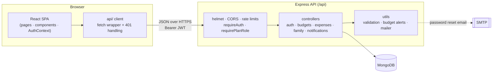

<div align="center">

# 💸 BudgetBuddy

**Personal and shared budgeting, without the spreadsheet.**

Plan a monthly budget, track every expense, and manage household money together with family or friends: shared plans, roles, and an approval workflow included.

[](https://github.com/M-Waleed-Ahmad/BudgetBuddy/actions/workflows/ci.yml)


</div>

---

## Table of contents

- [Features](#features)
- [Tech stack](#tech-stack)
- [Architecture](#architecture)
- [Getting started](#getting-started)
- [Demo accounts](#demo-accounts)
- [Configuration](#configuration)
- [Scripts](#scripts)
- [Testing](#testing)
- [API](#api)
- [Project structure](#project-structure)
- [Security](#security)
- [Deployment](#deployment)
- [Team](#team)

## Features

### Personal budgeting
- **Monthly budgets**: set an overall target for a period (calendar month or a custom date range).
- **Category limits**: give each spending category its own monthly limit, with progress bars that turn amber at 80% and red once you go over.
- **Expense tracking**: add, edit, search, filter, sort and export expenses to CSV.
- **Dashboard**: current-period spending vs. budget, recent expenses and a six-month spending trend per category.
- **Budget alerts**: in-app notifications the moment a category reaches 80% or exceeds 100% of its limit.
- **Multi-currency display**: amounts are formatted in each user's preferred currency (USD, EUR, GBP, PKR, INR and more).

### Shared (family) budgeting
- **Shared plans** with an optional overall budget, date range, currency and per-category limits.
- **Roles**: *admins* manage settings and members, *editors* add and manage their own expenses, *viewers* get read-only access. The plan owner can't be demoted or removed.
- **Invitations**: invite existing users by email. Invitations expire after 7 days, and admins can see and cancel pending ones.
- **Approval workflow**: optionally require an admin to approve expenses added by other members. Only approved expenses count toward the plan's totals.
- **Plan-level alerts and activity notifications** for invitations, role changes, new expenses and approvals.

### Accounts
- Sign up and log in with JWT sessions. Expired or revoked sessions log the user out automatically.
- **Password reset by email** with single-use links that expire after 30 minutes. Changing or resetting a password signs out every other session.
- Profile settings: name, recovery email, profile picture (optional Cloudinary upload) and preferred currency.
- A notification center with unread badges, mark-all-read and deep links to the relevant page.

## Tech stack

| Layer | Technologies |
|---|---|
| **Frontend** | React 19, React Router 7, Vite 6, Framer Motion, ECharts (tree-shaken), React Hot Toast, React Icons |
| **Backend** | Node.js, Express 5, Mongoose 8 (MongoDB), JSON Web Tokens, bcrypt.js, Helmet, express-rate-limit, Nodemailer |
| **Testing** | Jest, Supertest, mongodb-memory-server |
| **Tooling** | ESLint 9 (React + Hooks plugins), GitHub Actions CI |

## Architecture



- **Authentication**: the API issues a JWT on login or signup. The client stores it and sends it as a `Bearer` token. `requireAuth` verifies it and also rejects tokens issued before the user's last password change.
- **Authorization**: every personal resource is queried by `{ _id, user_id }`, so other users' records simply return 404. Shared-plan routes go through `requirePlanRole([...])`, which loads the plan and the caller's membership and enforces their role.
- **Dates**: calendar dates (expense dates, budget periods) are stored as UTC midnight and displayed in UTC, so a "3 October" expense stays on 3 October in every time zone.

## Getting started

### Prerequisites
- **Node.js 18+** and npm
- A **MongoDB** database: [MongoDB Atlas](https://www.mongodb.com/atlas) (free tier works) or a local `mongod`

### 1. Clone and install

```bash
git clone https://github.com/M-Waleed-Ahmad/BudgetBuddy.git
cd BudgetBuddy
npm run install:all
```

`install:all` installs the root tooling plus the `backend/` and `frontend/` packages.

### 2. Configure environment variables

```bash
cp backend/.env.example backend/.env
cp frontend/.env.example frontend/.env   # optional
```

At minimum, set `MONGO_URI` and `JWT_SECRET` in `backend/.env`. You can generate a strong secret with:

```bash
node -e "console.log(require('crypto').randomBytes(48).toString('hex'))"
```

### 3. Load demo data (optional, recommended)

```bash
npm run seed
```

### 4. Run the app

```bash
npm run dev
```

This starts the API on **http://localhost:5000** and the web app on **http://localhost:5173**. In development, the Vite dev server proxies `/api` requests to the backend, so no CORS setup is needed.

## Demo accounts

`npm run seed` creates (or resets) these accounts, with six months of expenses, budgets, a shared household plan with a pending approval, and a pending invitation:

| Email | Password | What to try |
|---|---|---|
| `demo@budgetbuddy.app` | `DemoPass123` | Dashboard and budgets; approve Sara's pending expense; accept the "Hunza Road Trip" invitation |
| `sara@budgetbuddy.app` | `DemoPass123` | Editor view of the shared household plan |

The seed script only touches these two accounts and their data.

## Configuration

### Backend (`backend/.env`)

| Variable | Required | Description |
|---|:---:|---|
| `MONGO_URI` | ✅ | MongoDB connection string |
| `JWT_SECRET` | ✅ | Secret used to sign JWTs (use 32+ random characters) |
| `JWT_EXPIRES_IN` | | Session lifetime, e.g. `7d` (default) |
| `PORT` | | API port (default `5000`) |
| `NODE_ENV` | | `development`, `production` or `test` |
| `CLIENT_URL` | | Allowed frontend origin(s), comma-separated. The first is used in email links (default `http://localhost:5173`) |
| `TRUST_PROXY` | | Set to `true` behind a reverse proxy so rate limits see real client IPs |
| `SMTP_HOST`, `SMTP_PORT`, `SMTP_SECURE`, `SMTP_USER`, `SMTP_PASS`, `MAIL_FROM` | | SMTP settings for password reset emails. Without them, reset links are printed to the server console (and returned by the API outside production) |

### Frontend (`frontend/.env`)

| Variable | Description |
|---|---|
| `VITE_API_URL` | API base URL. Leave empty in development to use the proxy; set it to e.g. `https://api.example.com/api` in production |
| `VITE_CLOUDINARY_CLOUD_NAME`, `VITE_CLOUDINARY_UPLOAD_PRESET` | Optional unsigned upload preset for profile pictures. Uploads are hidden when unset |

## Scripts

Run from the repository root:

| Command | What it does |
|---|---|
| `npm run install:all` | Install root, backend and frontend dependencies |
| `npm run dev` | Start the API (with nodemon) and the Vite dev server together |
| `npm run seed` | Reset the demo accounts and load sample data |
| `npm test` | Run the backend test suite |
| `npm run lint` | Lint the frontend |
| `npm run build` | Build the frontend for production into `frontend/dist` |

Each package also has its own scripts: `backend` has `start`, `dev`, `test` and `seed`; `frontend` has `dev`, `build`, `preview` and `lint`.

## Testing

The backend has an integration test suite (Jest + Supertest) that exercises the real Express app against an in-memory MongoDB:

```bash
npm test
```

It covers:
- signup, login, sessions and the password reset flow
- data isolation: no user can read or modify another user's budgets, expenses, categories or notifications
- budgets, expenses, period totals, trends and budget-alert thresholds
- shared plans: role enforcement, invitations, the approval workflow, category limits and plan deletion

The first run downloads a MongoDB binary for `mongodb-memory-server`. To use an existing server instead, set `MONGO_TEST_URI`. Each test file then creates and drops its own throwaway database.

CI (GitHub Actions) runs the backend tests and the frontend lint and production build on every push and pull request.

## API

The REST API lives under `/api`. Every endpoint, request body, response shape and permission rule is documented in **[docs/API.md](docs/API.md)**.

| Area | Base path |
|---|---|
| Auth | `/api/auth` |
| Profile | `/api/user` |
| Categories | `/api/categories` |
| Monthly budgets | `/api/monthly-budgets` |
| Category budgets | `/api/budgets` |
| Expenses & analytics | `/api/expenses` |
| Shared plans, members, invites, expenses | `/api/family-plans` |
| Received invitations | `/api/invites` |
| Notifications | `/api/notifications` |
| Contact form, newsletter, health check | `/api/contact-us`, `/api/newsletter`, `/api/health` |

## Project structure

```text
BudgetBuddy/
├── backend/
│   ├── app.js              # Express app: security middleware, routes, error handling
│   ├── server.js           # Connects to MongoDB and starts the HTTP server
│   ├── config/env.js       # Environment loading and validation
│   ├── controllers/        # Request handlers, one per resource
│   ├── middleware/         # requireAuth, requirePlanRole, rate limits, error handler
│   ├── models/             # Mongoose schemas
│   ├── routes/             # Route definitions
│   ├── utils/              # Validation, dates, budget alerts, notifications, mailer
│   ├── scripts/seed.js     # Demo data
│   └── tests/              # Jest + Supertest integration tests
├── frontend/
│   ├── public/             # Favicon and static files
│   └── src/
│       ├── api/            # Fetch client and one module per API area
│       ├── components/     # Layout, navbar, modals, charts, shared UI
│       ├── context/        # AuthContext (session, current user, currency formatting)
│       ├── hooks/          # Data-loading hooks
│       ├── pages/          # Route-level pages (users/family/ holds the shared-plan feature)
│       ├── styles/         # Global tokens, shared styles and per-page CSS
│       └── utils/          # Formatting, CSV export, notification helpers
├── docs/API.md             # API reference
└── .github/workflows/ci.yml
```

## Security

- Passwords are hashed with bcrypt (12 rounds). Login returns the same error for an unknown email and a wrong password, and takes about the same time either way.
- JWTs are invalidated when the password changes. Invalid or expired tokens get `401`, and the client signs the user out.
- Ownership and role checks are enforced on the server for every resource, with integration tests to back them up.
- Password reset tokens are random, stored only as SHA-256 hashes, single-use and valid for 30 minutes. The forgot-password endpoint never reveals whether an account exists.
- Every input is validated, with consistent `{ message, errors }` error responses that never leak stack traces.
- Security headers come from Helmet, CORS is restricted to `CLIENT_URL`, request bodies are capped at 100 kB, and auth and public-form endpoints are rate limited.
- Secrets live only in environment variables. `.env` files are git-ignored and `.env.example` documents every setting.

## Deployment

The frontend is a static SPA and the backend is a standard Node service, so they can be hosted separately:

1. **Database**: create a MongoDB Atlas cluster and copy its connection string.
2. **API** (Render, Railway, Fly.io, a VPS…): set the root directory to `backend`, the start command to `npm start`, and set `MONGO_URI`, `JWT_SECRET`, `NODE_ENV=production`, `CLIENT_URL=https://your-frontend.example.com` and `TRUST_PROXY=true`. Add the SMTP variables to send real reset emails.
3. **Frontend** (Vercel, Netlify, Cloudflare Pages…): set the root directory to `frontend`, the build command to `npm run build` and the output directory to `dist`. Set `VITE_API_URL=https://your-api.example.com/api`, and configure a rewrite of all routes to `/index.html` so client-side routing works on refresh.

## Team

BudgetBuddy was built by:

- **[Waleed Ahmad](https://github.com/M-Waleed-Ahmad)**: team lead
- **Muhammad Saad**
- **Ashar Mehmood**
- **Azlan Khalid**
